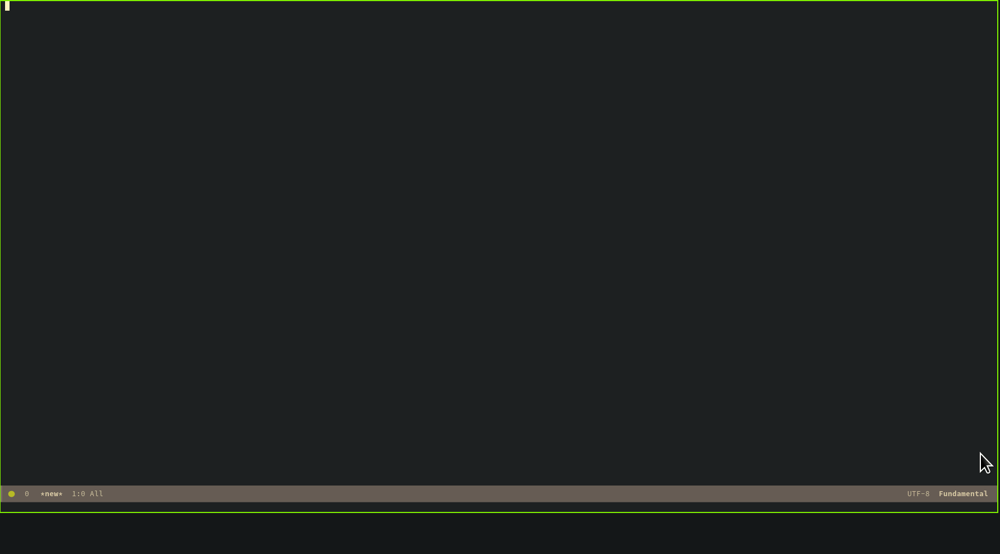

# bgf

BGF attempts to mimic the updated configuration in Windbg, but also utilizes Emacs for completion and command pass-through in both GDB and Python.

As of now this project is not configured for easy setup, and parts of the eLisp
config may be specific to my configuration. I plan to update it in the future to
be a standalone package.

## TODO

- containerize target using qemu
- rr integration
